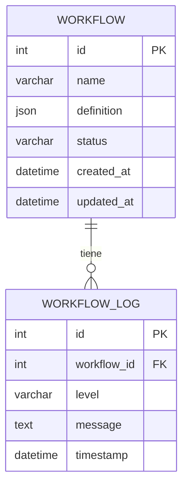

# Diseño de Base de Datos - Orquestador de Workflows

Este documento describe el esquema de la base de datos que el **Worker** debe implementar. La **API-puente** está diseñada para consumir una base de datos que siga esta estructura.

**Propietario del esquema:** Worker (Eugenio).
**Consumidor del esquema:** Backend API (Julio).

---

## Diagrama Entidad-Relación (Conceptual)

---

## 📖 Diccionario de Datos

### Tabla: `workflow`

Almacena la definición y el estado general de cada workflow.

| Columna | Tipo de Dato | Restricciones | Descripción |
|---|---|---|---|
| `id` | `INTEGER` | `PRIMARY KEY`, `AUTOINCREMENT` | Identificador único del workflow. |
| `name` | `VARCHAR(255)` | `NOT NULL` | Nombre descriptivo del workflow asignado por el usuario. |
| `definition` | `JSON` | `NOT NULL` | Objeto JSON que contiene la estructura del workflow (nodos, conexiones, parámetros). El Worker es el principal intérprete de este campo. |
| `status` | `VARCHAR(50)` | `NOT NULL` | Estado actual del workflow. Valores posibles: `pendiente`, `en_progreso`, `completado`, `fallido`, `cancelado`. |
| `created_at` | `DATETIME` | `NOT NULL`, `DEFAULT CURRENT_TIMESTAMP` | Fecha y hora de creación del registro. |
| `updated_at` | `DATETIME` | `NOT NULL`, `DEFAULT CURRENT_TIMESTAMP` | Fecha y hora de la última actualización. Debería actualizarse automáticamente. |

### Tabla: `workflow_log`

Registra los eventos y mensajes generados durante la ejecución de un workflow. Esencial para el monitoreo y la depuración.

| Columna | Tipo de Dato | Restricciones | Descripción |
|---|---|---|---|
| `id` | `INTEGER` | `PRIMARY KEY`, `AUTOINCREMENT` | Identificador único del log. |
| `workflow_id` | `INTEGER` | `FOREIGN KEY` a `workflow.id` | Asocia el log con un workflow específico. |
| `level` | `VARCHAR(20)` | `NOT NULL` | Nivel de severidad del log. Ej: `INFO`, `WARN`, `ERROR`, `DEBUG`. |
| `message` | `TEXT` | `NOT NULL` | Mensaje detallado del log. |
| `timestamp` | `DATETIME` | `NOT NULL`, `DEFAULT CURRENT_TIMESTAMP` | Fecha y hora en que se generó el log. |
