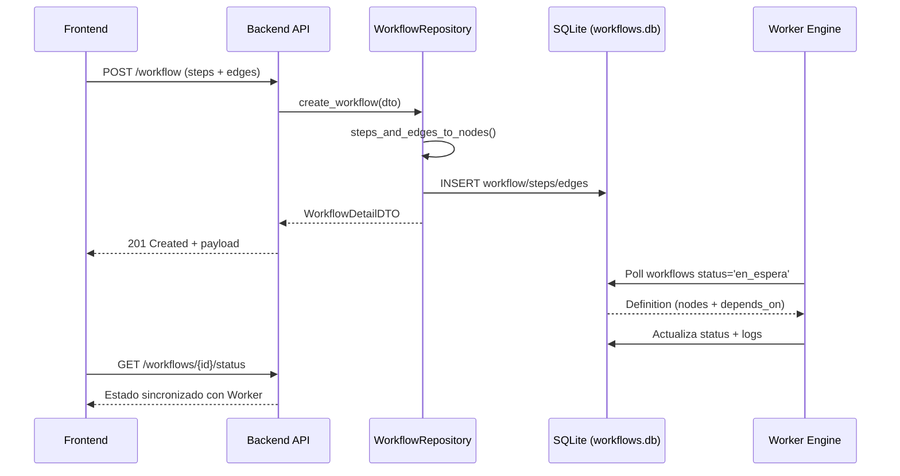
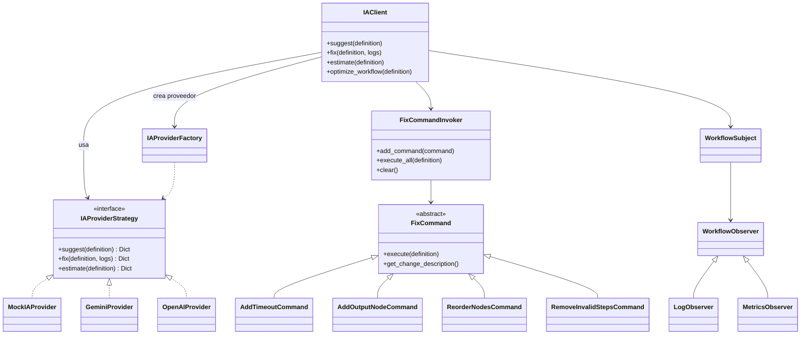
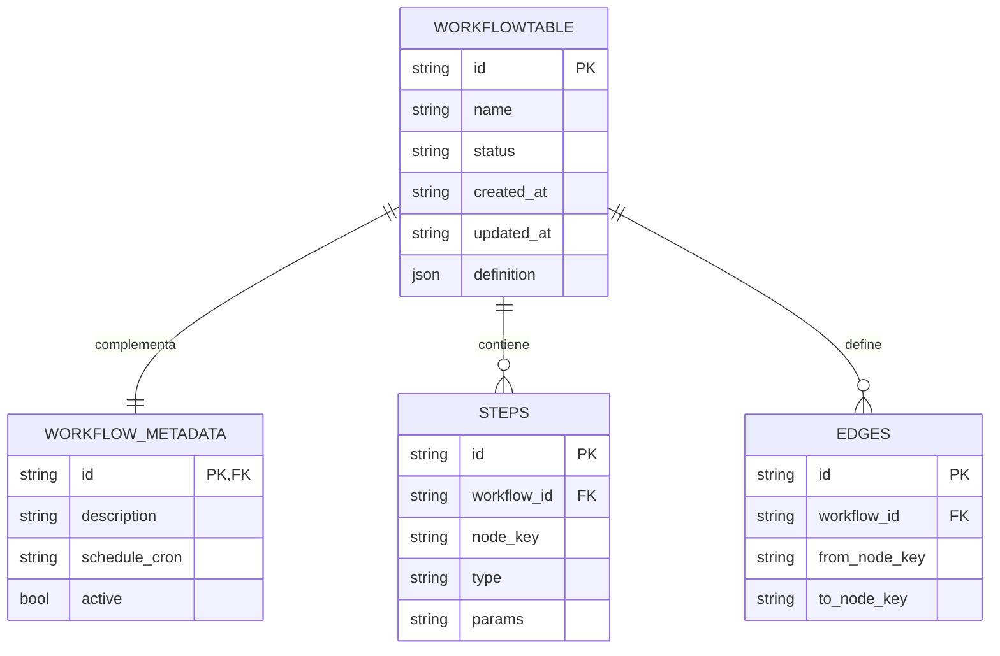

# ⚙️ Backend API — Orquestador de Workflows con IA

API basada en FastAPI que actúa como puente entre el Frontend colaborativo, el motor **Worker** y los proveedores de IA. Expone contratos REST/OpenAPI, normaliza formatos (steps/edges ↔ nodes/depends_on) y centraliza la orquestación de sugerencias, fixes y estimaciones automáticas.

---

## 📋 Tabla de Contenidos
- [Características](#-características)
- [Arquitectura](#-arquitectura)
- [Patrones de Diseño](#-patrones-de-diseño)
- [Diagrama UML del Subsistema IA](#-diagrama-uml-del-subsistema-ia)
- [Persistencia y Modelo de Datos](#-persistencia-y-modelo-de-datos)
- [Estructura del Proyecto](#-estructura-del-proyecto)
- [Instalación y Configuración](#-instalación-y-configuración)
- [Uso Rápido](#-uso-rápido)
- [Endpoints Principales](#-endpoints-principales)
- [Pruebas](#-pruebas)
- [Roadmap](#-roadmap)
- [Contribuciones](#-contribuciones)
- [Contacto](#-contacto)

---

## ✨ Características

- **API puente**: expone endpoints limpios para el Frontend mientras delega la ejecución real al Worker (`Backend/src/main.py`).
- **Persistencia compartida**: comparte `data/workflows.db` con el Worker usando SQLModel y el patrón Repository (`Backend/src/repository.py`).
- **Conversión de formatos**: adapta `steps`/`edges` a `nodes`/`depends_on` mediante utilidades tipo Adapter (`Backend/src/converters.py`).
- **Subsistema de IA extensible**: integra Strategy, Command, Observer y Factory para proveedores y operaciones de IA (`Backend/src/ia`).
- **Autenticación mock**: proxy HTTP Bearer simplificado para pruebas de integración.
- **Test suite completa**: cobertura de endpoints, repositorio e IA con `pytest`, `httpx` y escenarios SQLModel.

---

## 🏗️ Arquitectura

La API encapsula la capa de interacción con clientes. Recibe definiciones de workflows en formato de Frontend, las normaliza, persiste en la base compartida y expone estados actualizados que el Worker sincroniza. El subsistema IA opera como copiloto para sugerencias, fixes y estimaciones.

### 🔁 Diagrama de Componentes (UML)

```mermaid
graph TD
    FE[Frontend<br/>React / Vue] -->|REST / OpenAPI| API[Backend API<br/>FastAPI]
    API -->|DTOs & Validación| Repo[WorkflowRepository]
    Repo -->|CRUD SQLModel| DB[(SQLite<br/>workflows.db)]
    Worker[Worker Engine] -->|Polling & Ejecución| DB
    API -->|Eventos IA| IAClient[IAClient (Facade)]
    IAClient -->|Strategy| IAProviders[Proveedores IA<br/>Mock / Gemini / OpenAI]
    IAClient -->|Observer| Observers[LogObserver<br/>MetricsObserver]
    API -->|Status & Logs| FE
```

### 📈 Flujo de Creación de Workflow (UML Sequence)



---

## 🧠 Patrones de Diseño

| Patrón | Problema que resuelve | Implementación |
| --- | --- | --- |
| Repository | Centraliza y aisla el acceso a la base compartida Worker/Backend | `Backend/src/repository.py` |
| Adapter | Traduce formatos Frontend ↔ Worker para mantener contratos desacoplados | `Backend/src/converters.py` |
| Strategy | Permite intercambiar proveedores de IA sin tocar la API | `Backend/src/ia/providers.py` |
| Factory | Crea proveedores y comandos IA según configuración | `Backend/src/ia/factory.py`, `Backend/src/ia/commands.py` |
| Command | Encapsula fixes automatizados y aplica secuencias composables | `Backend/src/ia/commands.py` |
| Chain of Responsibility | Genera sugerencias IA modulables paso a paso | `Backend/src/ia/handlers.py` |
| Observer | Propaga métricas y logs de IA sin acoplar consumidores | `Backend/src/ia/observers.py` |
| Singleton / Facade | Expone un único `IAClient` que coordina Strategy, Command y Observer | `Backend/src/ia_client.py` |

Además, la validación de DTOs usa Pydantic, y FastAPI funciona como fachada REST respetando el principio de separación de responsabilidades.

---

## 🪄 Diagrama UML del Subsistema IA

El cliente IA actúa como fachada: orquesta comandos de fixes, proveedores intercambiables y observadores de telemetría.



---

## 🗃️ Persistencia y Modelo de Datos

- La API comparte el archivo `data/workflows.db` con el Worker.  
- El repositorio crea y usa tablas `workflowtable`, `workflow_metadata`, `steps` y `edges` en SQLite (`Backend/src/models.py`).  
- Las definiciones se almacenan dos veces: formato Worker (nodes + depends_on) para ejecución y formato Frontend (steps + edges) para edición.
- El diccionario de datos detallado y la especificación ER están en `Backend/BD_DISENIO.md`.

### 📐 Esquema conceptual (Mermaid ER)



---

## 🧱 Estructura del Proyecto

```text
Backend/
├── BD_DISENIO.md          # Diseño de base de datos compartida
├── README.md              # Este documento
├── requirements.txt       # Dependencias mínimas
├── src/
│   ├── ia/                # Subsistema IA (Strategy, Command, Observer, etc.)
│   │   ├── commands.py
│   │   ├── factory.py
│   │   ├── handlers.py
│   │   ├── observers.py
│   │   ├── providers.py
│   │   └── services.py
│   ├── converters.py      # Adaptadores steps↔nodes
│   ├── ia_client.py       # Facade + Singleton del subsistema IA
│   ├── main.py            # App FastAPI y configuración
│   ├── main_backup.py     # Versiones previas / sandbox
│   ├── models.py          # SQLModel y DTOs Pydantic
│   └── repository.py      # Patrón Repository
├── test_auth.py           # Smoke test de autenticación
└── tests/                 # Suite de pruebas (pytest + httpx)
```

---

## 🛠️ Instalación y Configuración

1. **Python 3.11+ recomendado.** Crear un entorno virtual (`python -m venv .venv`) y activarlo.  
2. Instalar dependencias básicas:
   ```bash
   pip install -r requirements.txt
   ```
3. Crear el archivo `.env` (opcional) en `Backend/`:
   ```text
   IA_PROVIDER=mock          # mock | gemini | openai
   GEMINI_API_KEY=...       # requerido si IA_PROVIDER=gemini
   OPENAI_API_KEY=...       # alternativo si IA_PROVIDER=openai
   MOCK_TOKEN_SECRET=demo   # usado por pruebas de autenticación
   ```
4. Asegurarse de que exista el directorio `data/`. El repositorio lo crea automáticamente si no está presente.

---

## 🚀 Uso Rápido

```bash
cd Backend
uvicorn src.main:app --reload --port 8000
```

- **Swagger UI:** http://127.0.0.1:8000/docs  
- **ReDoc:** http://127.0.0.1:8000/redoc  
- Tokens mock: autenticarse con `username=demo`, `password=demo123` (ver `POST /login`).

---

## 📡 Endpoints Principales

| Método | Ruta | Descripción | Auth |
| --- | --- | --- | --- |
| `POST` | `/login` | Devuelve token mock y datos mínimos de usuario | No |
| `GET` | `/task-types` | Catálogo de tareas disponibles en el Worker | Sí (`Bearer mock-*`) |
| `POST` | `/workflow` | Crea workflow (steps + edges) y lo publica para el Worker | Sí |
| `GET` | `/workflows` | Lista workflows con metadatos y estado actual | Sí |
| `GET` | `/workflows/{id}` | Recupera workflow con steps y edges | Sí |
| `GET` | `/workflows/{id}/status` | Consulta estado sincronizado con el Worker | Sí |
| `POST` | `/ia/suggestion` | Genera sugerencias estructuradas (Chain of Responsibility) | Sí |
| `POST` | `/ia/fix` | Ejecuta comandos de fix y detalla cambios aplicados | Sí |
| `POST` | `/ia/estimate` | Predice tiempo, costo y complejidad (CostPredictor) | Sí |

Consulte `Backend/src/main.py` para contratos y ejemplos adicionales.

---

## 🧪 Pruebas

- Ejecutar toda la suite:
  ```bash
  pytest
  ```
- Pruebas destacadas:
  - `tests/test_workflows.py`: creación y lectura de workflows.
  - `tests/test_repo_sqlmodel_unit.py`: validez del Repository + conversores.
  - `tests/test_ia*.py`: Strategy, Command, Observer y estimaciones.
  - `tests/integration/*`: escenarios end-to-end con SQLite en memoria.

Las pruebas in-memory comparten el esquema con el Worker y garantizan que los contratos no se rompan al sincronizar.

---

## 🗺️ Roadmap

### ✅ Completado
- API puente FastAPI con validación Pydantic y documentación OpenAPI.
- Persistencia compartida Worker/Backend mediante Repository y SQLModel.
- Subsistema IA modular (Strategy, Command, Observer, Factory).
- Conversores bidireccionales steps ↔ nodes validados por tests.

### 🚧 En progreso
- Exposición de métricas del Observer vía endpoint dedicado.
- Integración con autenticación real (tokens firmados).
- Sincronización incremental de logs de ejecución.

### 🔭 Futuro
- Webhooks o WebSockets para notificaciones push al Frontend.
- Integración con colas (Celery / Redis) para desacoplar polling.
- Modelos IA externos híbridos (costo/calidad) con canje dinámico.

---

## 👥 Contribuciones

1. Haz fork del repositorio.  
2. Crea una rama (`git checkout -b feature/nombre-feature`).  
3. Ejecuta `pytest` antes de abrir PR.  
4. Describe claramente cambios y pruebas en tu Pull Request.

---

## 📎 Recursos Relacionados

- Documentación del Worker: `Worker/Documentacion/README.md`.
- Diseño de base de datos completo: `Backend/BD_DISENIO.md`.

---

## 📧 Contacto

- **Owner Backend:** Julio Augusto Sánchez  
- **Colaboradores clave:** Paulina (Frontend), Eugenio (Worker), Equipo IA.  
- ¿Dudas o propuestas? Abre un issue o envía un correo a juliodev@example.com.

---

⭐ Si este backend te resultó útil, ¡dale una estrella al monorepo!
